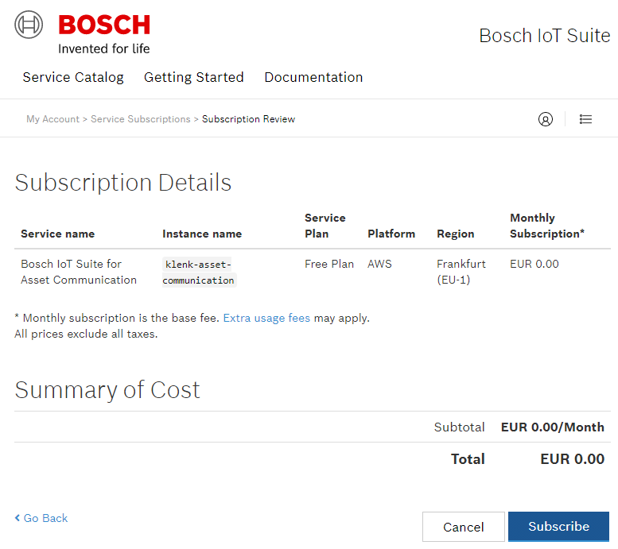
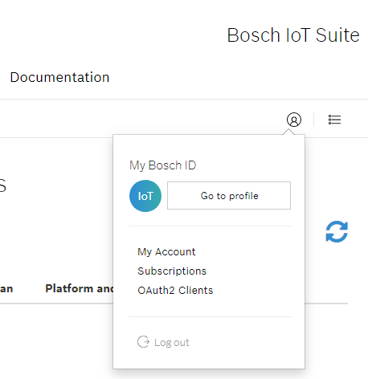
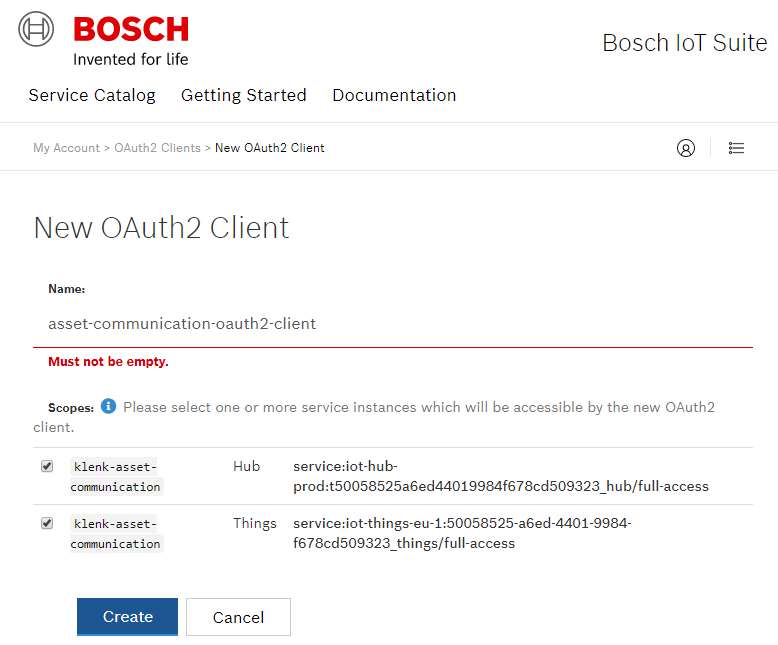
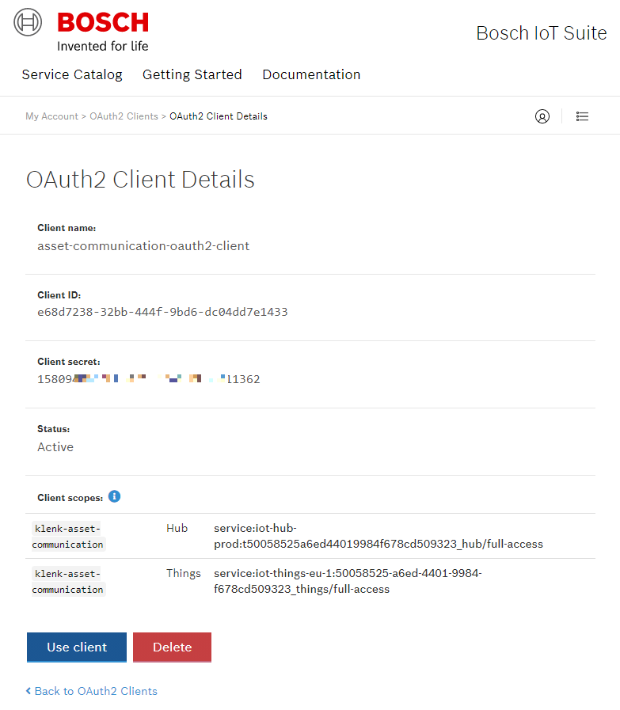

# rak8212-espruino-bosch-iot-platform
Example how to connect to the Bosch IoT Platform using the Quectel BG96's built-in MQTT stack.

The example will be a simple data logger, periodically sending sensor
values using NB-IoT connectivity.

The RAK8212 has quite a few sensors on board:

* Temperature
* Humidity
* Barometeric Pressure
* Ambient Light
* Accelerometer
* Magnetometer
* Location (GNSS)

## Step 1: Subscribe to Bosch IoT Suite
Create yourself a **Bosch IoT Suite account** at http://bosch-iot-suite.com 
and then subscribe to a free plan of the 
**Bosch IoT Suite for Asset Communication** service package. 
This is a ready-to-use integration of **Bosch IoT Hub** and **Bosch IoT Things** for 
large-scale ingestion of sensor telemetry data and for remote asset control.

Give a name to this service package instance, like `klenk-asset-communication`. 

A tutorial how to get started with the Bosch IoT Suite can be found here:
https://www.bosch-iot-suite.com/getting-started

## Step 2: Create OAuth2 Client

The Bosch IoT Suite is composed of several services, and all of these services need you to 
authenticate to interact with them. Fortunately, you can make use of OAuth2 security tokens to
authenticate, and the Bosch IoT Suite has a built-in OAuth2 Client that can be used to generate
these OAuth2 tokens. 

Click the Account Icon, and from the pull-down menu select "OAuth2 Clients".

Create a new OAuth2 Client, assign a name to it and for "scope" select both the "Hub" and "Things".

When created, it takes some time for the Suite to create the new OAuth2 Client, but when finished
it provides a  `Client ID` and a `Client secret` for you that can be used to create OAuth2 tokens from
now on, either interactively in this web portal, or programmatically by other applications that
need to authenticate against Bosch IoT Suite services ("Suite Authentication").

To be continued ...